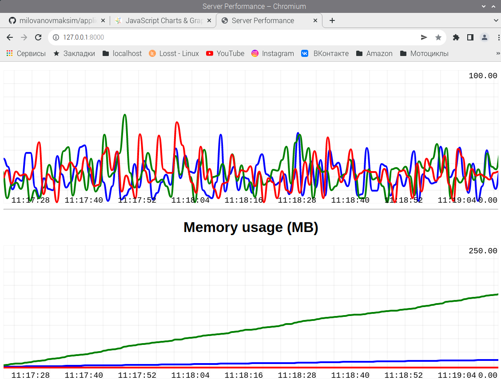

# application_perfomance_monitoring

С современными практиками развертывания на основе контейнеров и микросервисов некоторые вещи, которые раньше были тривиальными, такие как мониторинг использования ЦП и памяти вашими приложениями, стали несколько сложнее, чем просто запуск **top** в терминале. За последние несколько лет появилось несколько коммерческих продуктов для решения этих проблем, но их стоимость может быть непомерно высокой для небольших стартапов и любителей.

В этом примере я буду использовать **ØMQ** и **asyncio** для создания игрушечного прототипа для мониторинга распределенных приложений. Дизайн состоит из трех частей: 
***1. Application layer (Прикладной уровень)*** 
Этот слой содержит все приложения. Примерами могут быть микросервис «клиенты», микросервис «бронирования», микросервис «электронная почта» и так далее. Я добавлю «передающий» сокет ØMQ в каждое из приложений. Этот сокет будет отправлять показатели производительности на центральный сервер.

***2. Collection layer (Уровень сбора)*** 
Центральный сервер предоставит сокет ØMQ для сбора данных со всех запущенных экземпляров приложения. Сервер также будет обслуживать веб-страницу для отображения графиков производительности с течением времени и будет транслировать данные в режиме реального времени по мере их поступления.

***3. Visualization layer (Уровень визуализации)*** 
Это обслуживаемая веб-страница. Будем отображать собранные данные в наборе диаграмм, а диаграммы будут обновляться в режиме реального времени. Для упрощения примеров кода я использовал удобную JavaScript-библиотеку Smoothie Charts, которая предоставляет все необходимые возможности на стороне клиента.

Для запуска collection layer ввести инструкцию в командной строке: 
**python metric_server.py** 
======== Running on http://127.0.0.1:8000 ======== 
(Press CTRL+C to quit) 

Следующим шагом будет запуск всех экземпляров микросервиса.
Они будут отправлять свои показатели использования ЦП и памяти сборщику (Collection layer).
Каждая линия на графике будет обозначена своим цветом, который указан в командной строке: 
**python backend_app.py --color red &** 
**python backend_app.py --color blue --leak 10000 &** 
**python backend_app.py --color green --leak 100000 &**  
На картинке представлен результат работы приложения в окне браузера http://127.0.0.1:8000 

